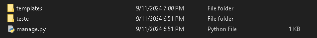
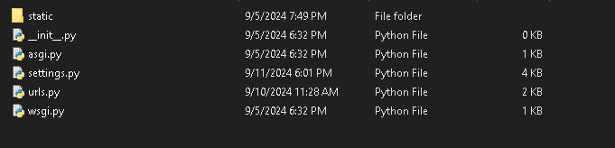
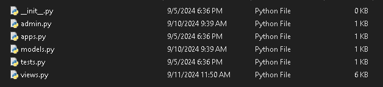
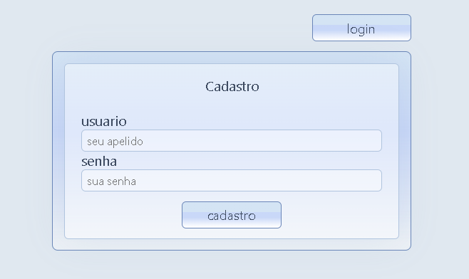
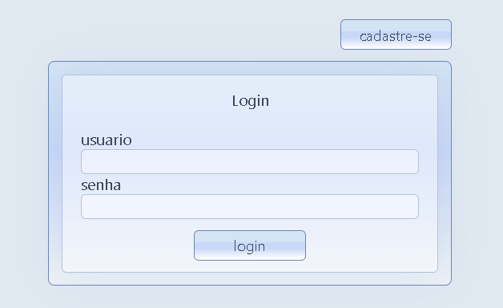
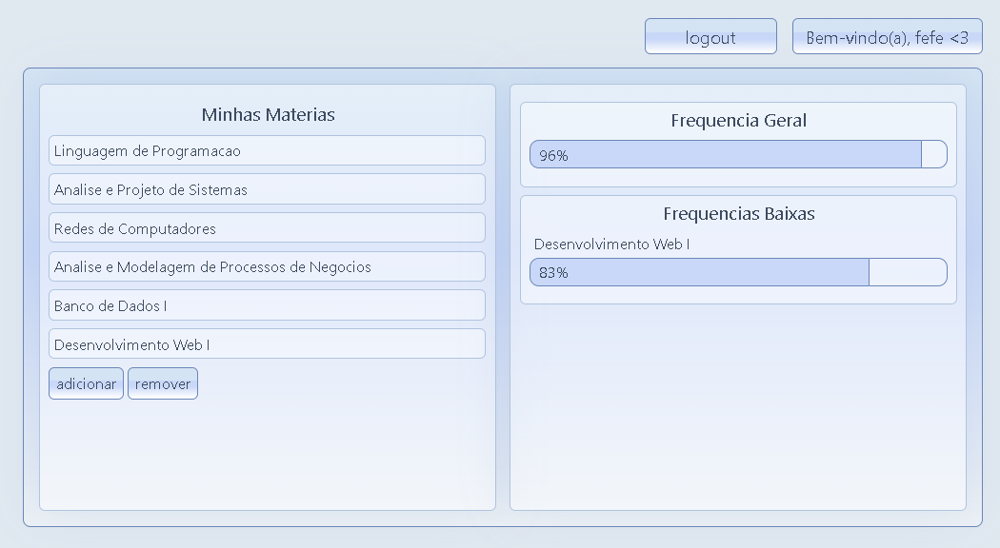

# agendinha 📝💕

Projeto Django feito em 6 dias que permite que os usuários cadastrem suas matérias, notas e faltas de maneira simples e organizada. Ele calcula automaticamente a situação de cada matéria, ajudando o usuário a saber quanto precisa para passar e destacando matérias com frequência baixa, que precisam de mais atenção.
As informações guardadas são vinculadas aos seus usuários e só podem ser acessadas por seus respectivos donos, garantindo privacidade aos estudantes.

## Instalação


1. Clone o repositório e instale as dependências. É preferível instalar em um virtualenv:
```sh
    git clone https://github.com/fe-fe/agendinha/
    cd agendinha
    py -m venv venv
    venv\scripts\activate
    pip install -r requirements.txt
```

2. Crie seu projeto Django:
```sh
    django-admin startproject (nome do projeto)
```

3. Volte para a pasta onde está o arquivo "manage.py" e crie um app chamado "core" com o Django:
```sh
    py manage.py startapp core
```

4. Na pasta principal, com o nome que você deu ao projeto, copie a pasta "templates" deste repositório



<br>
5. Entre na outra pasta com o nome do projeto e copie nela os arquivos da pasta "project" deste repositório

 
<br>
6. Vá para a pasta do app e copie para dentro dela os arquivos da pasta "app" deste repositório



7. Construa e aplique as migrations
```sh
    py manage.py makemigrations
    py manage.py migrate
```

8. Colete os arquivos estaticos

```sh
    py manage.py collectstatic
```

9. Finalmente, inicie o servidor!

```sh
    py manage.py runserver
```

## Uso

1. Para começar, é só fazer seu cadastro e login:<br><br>



2. No painel, você pode adicionar suas matérias e ver sua frequência:<br><br>


3. Clicando em uma matéria, você pode ver e editar seus detalhes:<br><br>


## <3
