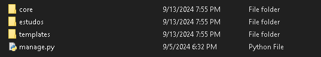
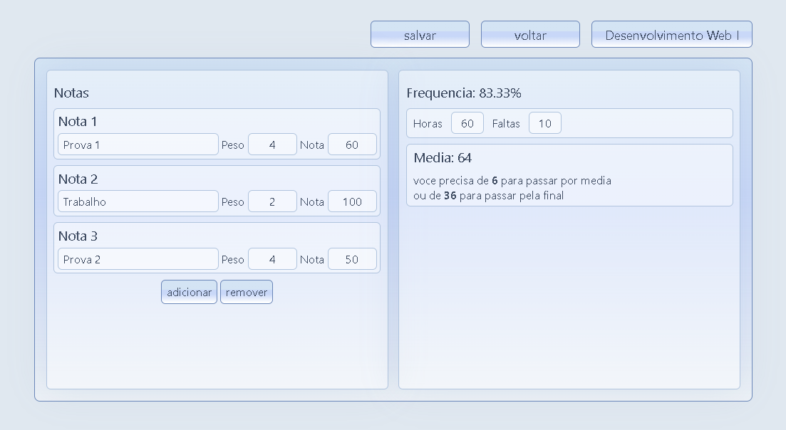

# agenda.me 📝💕

Projeto Django que permite que os usuários cadastrem suas matérias, notas e faltas de maneira simples e organizada. Ele calcula automaticamente a situação de cada matéria, ajudando o usuário a saber quanto precisa para passar e destacando matérias com frequência baixa, que precisam de mais atenção.
As informações guardadas são vinculadas aos seus usuários e só podem ser acessadas por seus respectivos donos, garantindo privacidade aos estudantes.

## Instalacao


1. Preparacao inicial
  Clone o repositorio, e instale as dependencias. E preferivel instalar em um virtualenv:
```sh
    git clone https://github.com/fe-fe/agendame/
    cd agendame
    py -m venv venv
    venv\scripts\activate
    pip install -r requirements.txt
```

2. Criando seu projeto Django
```sh
    django-admin startproject (nome do projeto)
```

3. Volte para pasta onde esta o arquivo "manage.py" e crie um app chamado "core" com o Django
```sh
    py manage.py startapp core
```

4. Na pasta principal, com o nome que voce deu ao projeto, copie a pasta "templates" deste repositorio


5. Entre na outra pasta com o nome do projeto e copie nela os arquivos da pasta "project" desse repositorio

 
6. Va para a pasta do app e copie para dentro dela os arquivos da pasta "app" desse repositorio


7. Construa e aplique as migrations
```sh
    py manage.py makemigrations
    py manage.py migrate
```

8. Colete os arquivos estaticos
```sh
    py manage.py collectstatic
```

9. Finalmente, inicie o servidor!
 ```sh
    py manage.py runserver
```

## Uso

1. Para comecar, e so fazer seu cadastro e login:


2. No painel, voce pode adicionar suas materias e ver sua frequencia:


3. Clicando numa materia, voce pode ver e editar seus detalhes:



